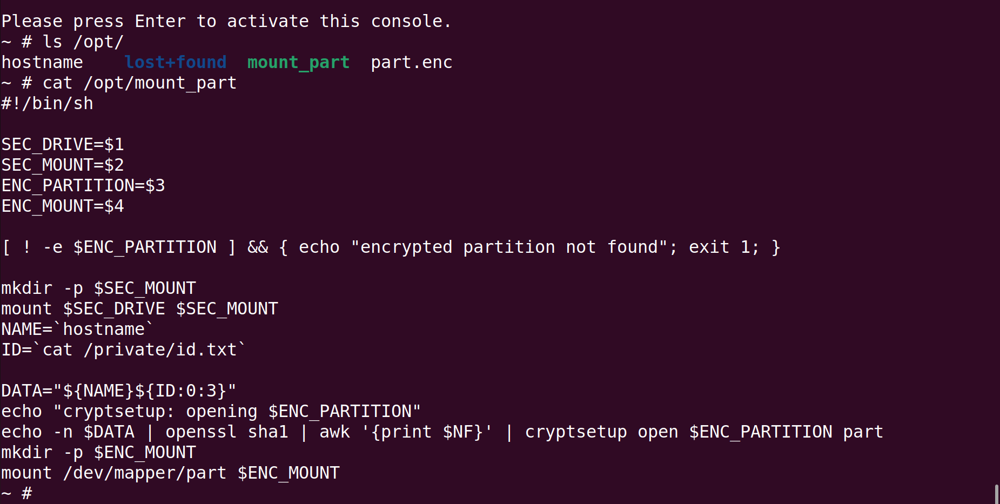

# Task 4

```
We were able to extract the device firmware, however there isn't much visible on it. All the important software might be protected by another method.

There is another disk on a USB device with an interesting file that looks to be an encrypted filesystem. Can you figure out how the system decrypts and mounts it? Recover the password used to decrypt it. You can emulate the device using the QEMU docker container from task 3.


Downloads:

    main SD card image (sd.img.bz2)
    USB drive image (usb.img.bz2)
    Linux kernel (kernel8.img.bz2)
    Device tree blob file for emulation (bcm2710-rpi-3-b-plus.dtb.bz2)

Enter the password used to decrypt the filesystem.
```

Ok so this challenge builds off of the last one and we are given the kernel that was decrypted using the key from task 3. We were also given the sd card image for the main raspberry pi OS, the linux kernel for the rapsberry pi, the device tree and the USB drive image for the file system that gets decrypted. So, we need to find where the USB filesystem gets decrypted and ultimately what the key is that is used in the decryption process. 

Running the Qemu emulator with the provided code from the README.md we get the following output and are then droped into the OS shell 

So it looks like there is some setup scripts being run and then in the output it mentions a key not being avalible with the passphrase. This seems like something we might want to investigate. 

To start off lets look at the SD card img file in Autopsy. Autopsy will give us a good overview of the file system and highlight any important files. So the OS seems to be a version of the raspberrypi OS with some modifcations. Looking at the start up scripts in `/etc/init.d/` we see the `rcs` file. This script corresponds to what we saw in the output from the emulator, mounting some drives and setting up some networking and possibly the main information collecting program. Most importantly though we see the following command run:
``
/opt/mount_part /dev/sda2 /private /opt/part.enc /agent
``
This looks like it runs a program `mount_part` with the encrypted USB filesystem and possibly some key values and output directories as input. 

Looking at the `mount_part` file either by looking at the USB img file in Autopsy or through the emulated OS we see the contents of the file.


So the script mounts the USB drive then reads the hostname and 3 characters from the id file and passes those to the sha1 algorithm for use as the password to decrypt the `part.enc` partition.

When we look at the `id.txt` file it is filled with null bytes, they are not gonna make it that easy to find the password. The solution I came up for this was to use `hashcat` to find the last three characters we need for the password. 
This hashcat command will output a wordlist with all the variations of the hostname with 3 lowercase letters or numbers appended.
```hashcat -m 14600 -stdout -a 3 -1="?l?d" angrycameo?1?1?1 > wordlist-l-num.txt```

After generating the wordlist we need run the sha1 function on every wordlist entry. To do this I created a small python script `hasher.py`. Now we can run `hashcat` against the encrypted filesystem using the sha1 wordlist file.

`hashcat -m 14600 -w 4 -a 0 -o cracked  part.enc wordlist-l-num-hash.txt`

This process took about 4 hours to run but eventually we got the password 
`d48dbcf0e295820e78ea4f1067139fe57b3d3e21`
which is before the sha1 hash is applied
`angrycameo7d2`

Using `d48dbcf0e295820e78ea4f1067139fe57b3d3e21` as the password we can decrypt the fileshare with the command
`echo -n "d48dbcf0e295820e78ea4f1067139fe57b3d3e21" | sudo cryptsetup luksOpen part.enc part`
and see the decrypted files and solve task 4. 