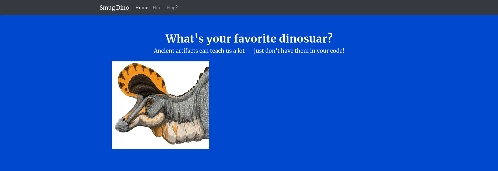
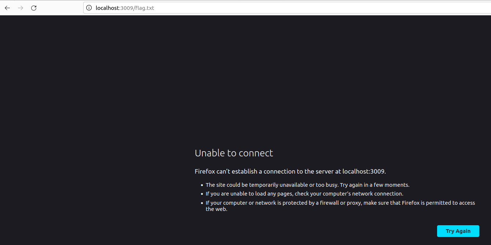
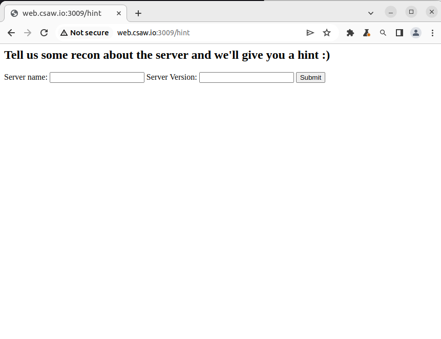
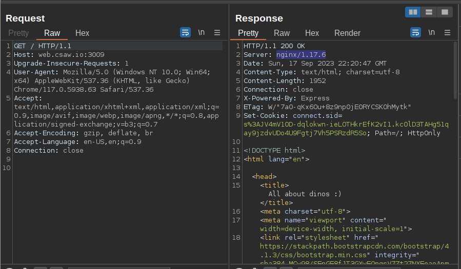
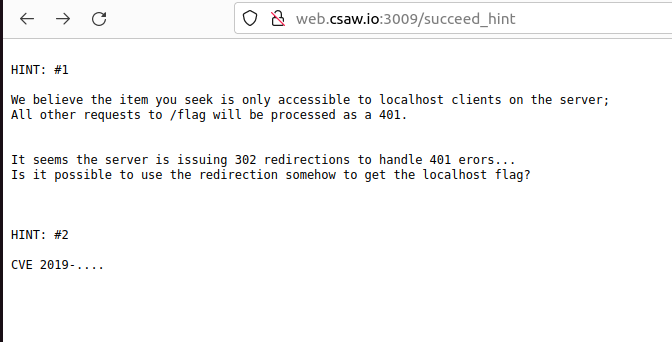

# Smug-Dino (Web 50) Writeup

----
## Challenge
```text
Don't you know it's wrong to smuggle 
dinosaurs... and other things?
http://web.csaw.io:3009/.
```
----
----
## Dinos
Opening the challenge link we are given the folllowing web page
 asking us our favorite dinos.

A flag page lets try to access that! 

Unable to connect thats wierd. The page was trying to access ``` http://localhost:3009/flag.txt ``` that not going to work. We need to access the flag on the server. 
---
## Hint
Lets checkout the other page on the site.

Seems like if we can find what the server is running and the version number we can get a hint to solve the challenge ! Firing up burpsuite and sending a request to the server we can see what the site is running in the response from the server.

Inputing Sever name: ```ngnix``` and Server version ```1.17.6``` we get the first hint for the challenge.
